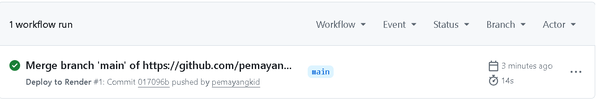
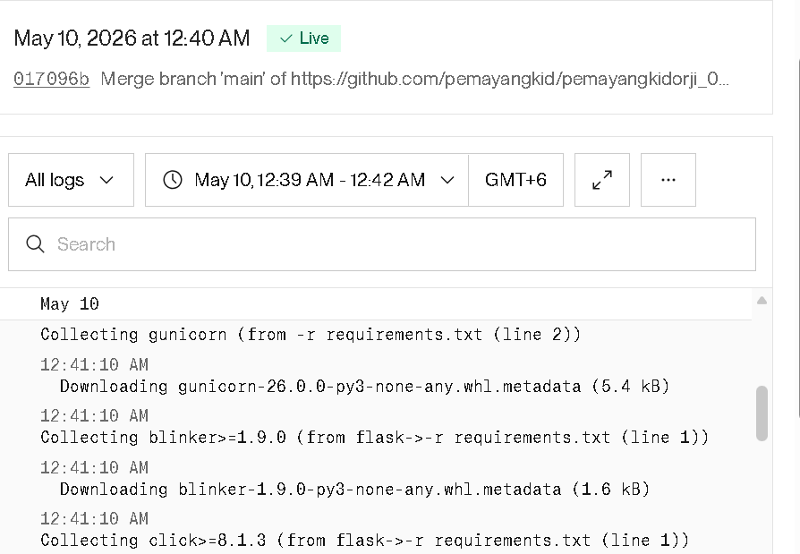
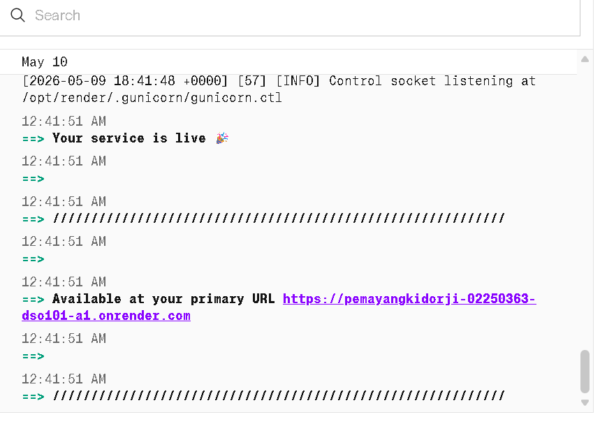

# My First DevOps App

## Steps I Followed
1. Created a Flask app
2. Pushed code to GitHub
3. Set up GitHub Actions workflow

4. Deployed on Render

## Live URL
https://pemayangkidorji-02250363-dso101-a1.onrender.com