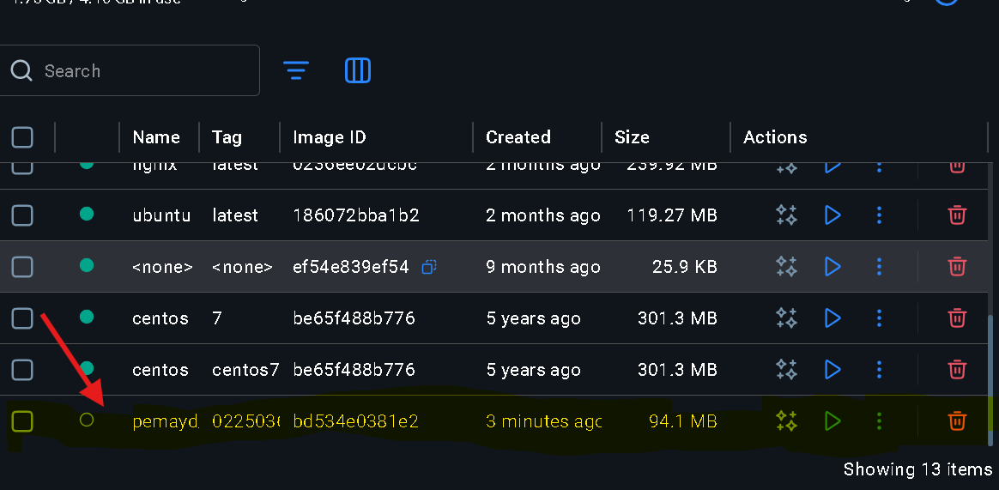
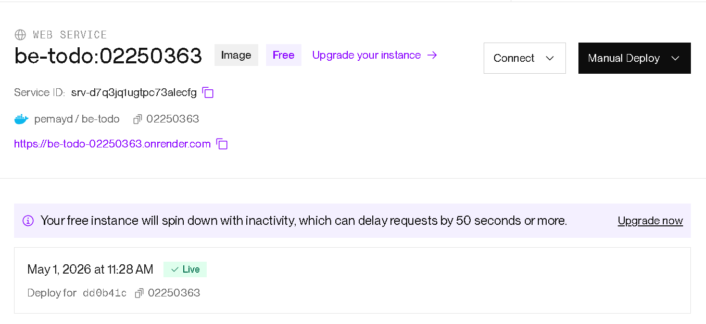
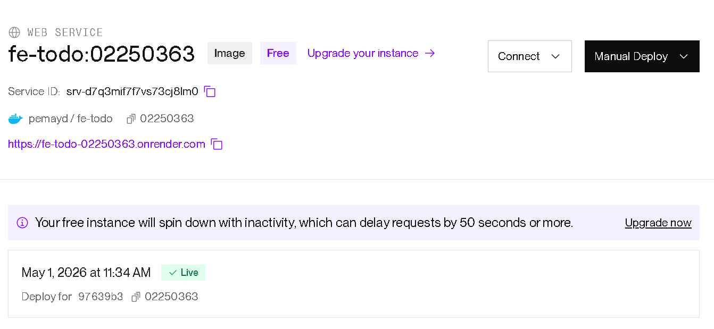
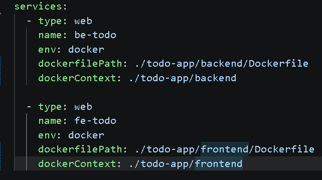
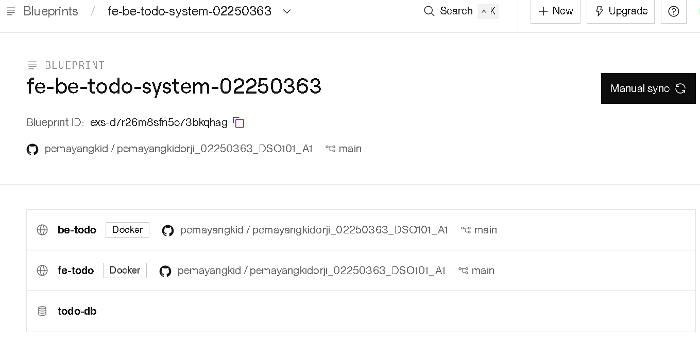
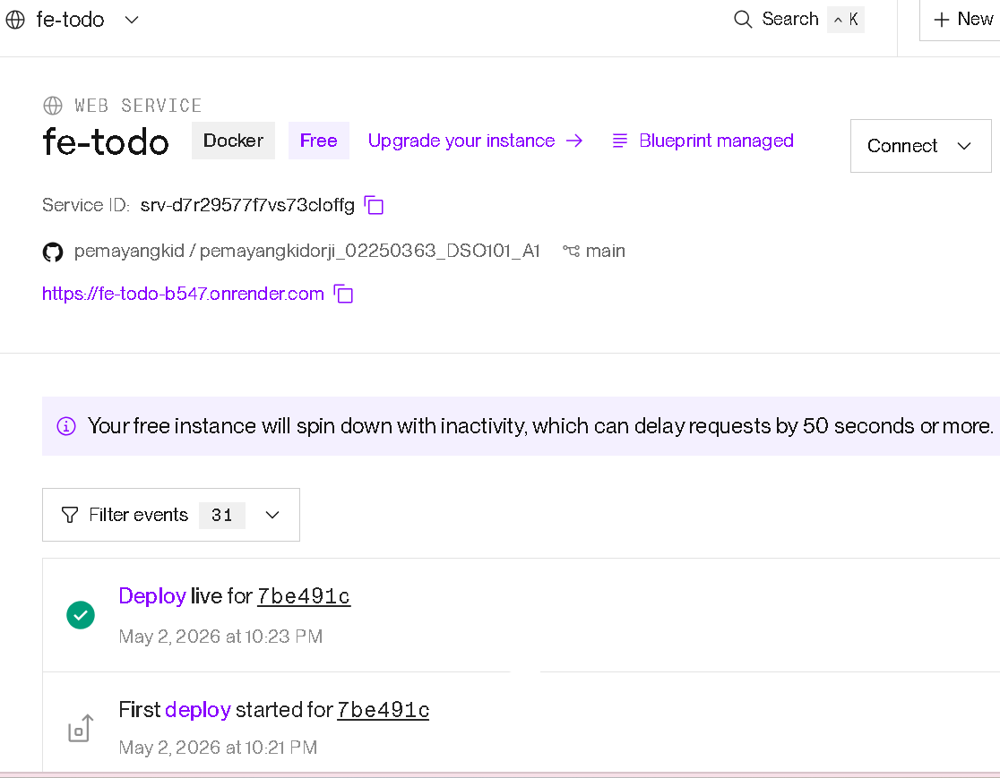

[Git repo]https://github.com/pemayangkid/pemayangkidorji_02250363_DSO101_A1.git
# Pema Yangki Dorji_02250363_DSO101_A1

[Git repo]https://github.com/pemayangkid/pemayangkidorji_02250363_DSO101_A1.git

## Part A — Docker Hub + Manual Render Deploy
### Docker Hub push

### Render backend service

[Screenshot of live backend URL responding]

### Render frontend service

## Part B — Auto Deploy via render.yaml
### render.yaml contents

### GitHub → Render connection

### Auto-deploy triggered by git push
